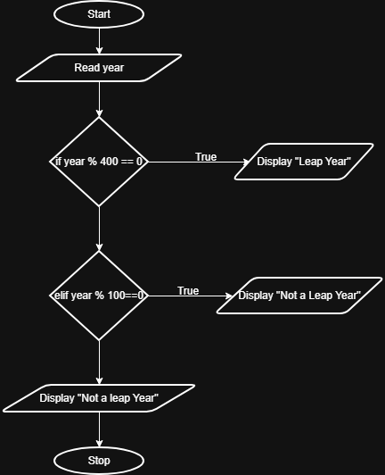

## Problem Statement
Write a Python program that prompts the user to enter a year. The program should determine if the year is a leap year or not and print the appropriate message.
---

## Algorithm
1. Start.  
2. Read the year from the user
3. If the year is divisible by 400
  → Print "Leap Year"
4. Else if the year is divisible by 100
  → Print "Not a Leap Year"
5. Else if the year is divisible by 4
  → Print "Leap Year"
6. Else
  → Print "Not a Leap Year"
7. Stop
---

## Flowchart

---

## Execution

  

