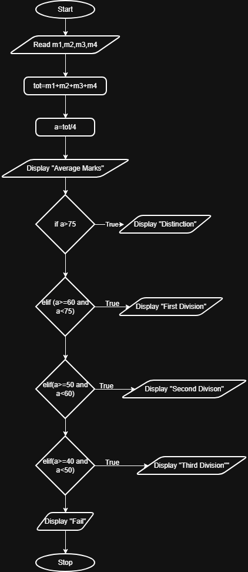

## Problem Statement
Write a program to calculate the total marks, aggregate percentage, and grade of a student based on marks in four subjects. The grade is determined as follows:

Aggregate > 75 : Distinction.
Aggregate >= 60 and < 75 : First Division.
Aggregate >= 50 and < 60 : Second Division.
Aggregate >= 40 and < 50 : Third Division.
Aggregate < 40 : Fail.
---

## Algorithm
1. Start
2. Read four marks: m1, m2, m3, m4
3. Calculate total marks:-
    total = m1 + m2 + m3 + m4
4. Calculate aggregate percentage
    percentage = total / 4
5. If percentage > 75
    Print "Distinction"
6. Else if percentage >= 60 and percentage < 75
    Print "First Division"
7. Else if percentage >= 50 and percentage < 60
    Print "Second Division"
8. Else if percentage >= 40 and percentage < 50
    Print "Third Division"
9. Else
    Print "Fail"
10. Print total marks
11. Print aggregate percentage
12. Stop.

## Flowchart

---

## Execution

  

