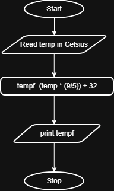
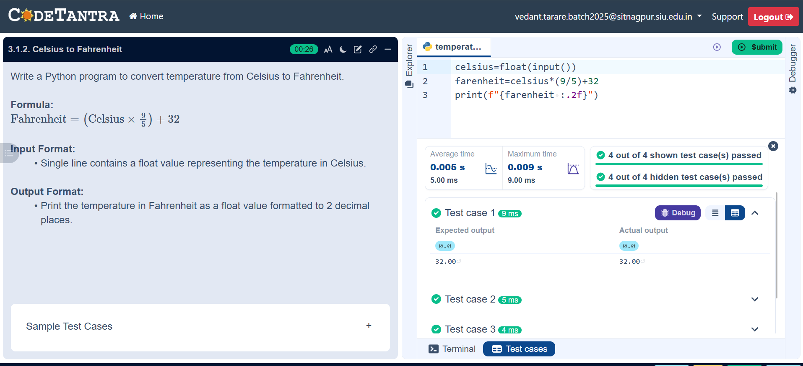

## Problem Statement
Write a Python program to convert temperature from Celsius to Fahrenheit.

---

## Algorithm
1. Start.  
2. Input temperature in Celsius C.
3. Calculate Fahrenheit using the formula
    F = (C × 9/5) + 32.
4. Display the temperature in Fahrenheit.
5. Stop
---

## Flowchart

---

## Execution

  

